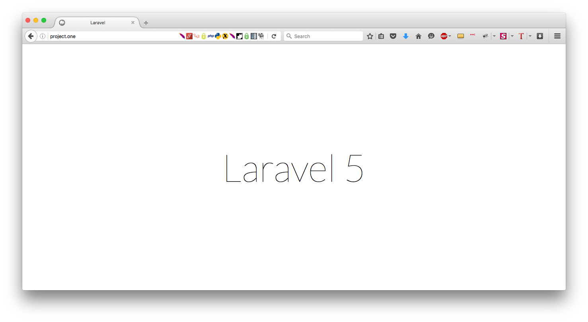

#লারাভেল ইন্সটল
***
##প্রস্তুতি
আসুন নিচের কমান্ডটির মাধ্যমে আমাদের প্রোজেক্ট project.one ইন্সটল করি।
```bash
composer create-project laravel/laravel project.one
```
ইন্সটল হবার পর ভার্সন চেক করলাম, আপনি নিশ্চয় আরও আপডেটএড ভার্সন পাবেন।


ভার্চুয়াল হস্ট কনফিগার করার জন্য আমার host(OS X path: /private/etc/hosts) ফাইলে নিচের অংশ
```bash
#Project 1 - howtocode.com.bd
127.0.0.1   project.one
```

ও httpd-vhosts.conf(OS X path: /Applications/MAMP/conf/apache/extra/httpd-vhosts.conf) ফাইলে নিচের অংশ
```bash
<VirtualHost *:80>
    DocumentRoot "/Applications/MAMP/htdocs/project.one/public"
    ServerName project.one
</VirtualHost>
```  
আপনি নিশ্চয় বুজতে পারছেন এই প্রোজেক্টটি করার সময় আমি MAMP ব্যবহার করছি।

এবার এড্রেস বার এ ```http://project.one``` দিয়ে দেখি



এই প্রোজেক্টতে আমরা ব্লেড টেম্পলেট দিয়ে Form তৈরি করবো তাই আসুন ```laravelcollective/html``` যোগ করে নেই আমাদের প্রোজেক্ট এ। প্রয়োজনে  [ব্লেড টেমপ্লেটিংঃ HTML ও Forms](http://laravel.howtocode.com.bd/blade-template.html#%E0%A6%AC%E0%A7%8D%E0%A6%B2%E0%A7%87%E0%A6%A1-%E0%A6%9F%E0%A7%87%E0%A6%AE%E0%A6%AA%E0%A7%8D%E0%A6%B2%E0%A7%87%E0%A6%9F%E0%A6%BF%E0%A6%82%E0%A6%83-html-%E0%A6%93-forms) অংশটি আরেকবার দেখে নিন।

এবার একটি mySQL ডাটাবেজ তৈরি করে ফেলুন।
ধরি,

Database Name: blog

server: 127.0.0.1 মানে আপনার লোকাল হোস্ট

User: root

Pass: root

তাহলে এবার .env ফাইলটি খুলুন ও নিচের মতো পরিবর্তন করুন।
```php
DB_HOST=127.0.0.1
DB_PORT=3306
DB_DATABASE=blog
DB_USERNAME=root
DB_PASSWORD=root
```
বিশেষ করে ইউজার এর নাম ও পাসওয়ার্ড আপনার মতো করে দিন।
এই কন্সটান্ট গুলো ব্যবহার হয়েছে ```config/database.php``` ফাইলে। লক্ষ্য করুন, আপনি যদি ```.env``` ফাইলে 'DB_CONNECTION' কন্সটান্টটি সেট না করে থাকেন তাহলে সাধারণ ভাবে লারাভেল mySQL ডাটাবেজকেই সেট করে নিবে।

**এবার নিচের কমান্ডটি দেই**
```bash
composer require doctrine/dbal
```
এ ব্যাপারে [মাইগ্রেশন](http://laravel.howtocode.com.bd/migration.html) অধ্যায়ে আলোচনা হয়েছে।

##মাইগ্রেশন ও post টেবিল তৈরি
টার্মিনালে আমাদের প্রোজেক্ট ডাইরেক্টরি তে থেকে নিচের কমান্ডটি দেইঃ
```bash
php artisan make:migration create_posts_table --create=posts
```
বিষয়ে [মাইগ্রেশন](http://laravel.howtocode.com.bd/migration.html) অধ্যায়ে বিস্তারিত আলোচনা হয়েছে।

এবার ```project.one/database/migrations``` ভিতরের xxx_xx_xx_XXXXXX_create_posts_table.php ফাইলটি খুলি ও নিচের মতো পরিবর্তন করি।

```php
class CreatePostsTable extends Migration
{
    /**
     * Run the migrations.
     *
     * @return void
     */
    public function up()
    {
        Schema::create('posts', function (Blueprint $table) {
            $table->increments('id');
            $table->string('title', 255);
            $table->text('content');
            $table->tinyInteger('status')->default(0);
            $table->timestamps();
        });
    }

    /**
     * Reverse the migrations.
     *
     * @return void
     */
    public function down()
    {
        Schema::drop('posts');
    }
}
```
এবার ```project.one/database/migrations``` ভিতরে দেখুন আরও দুটি মাইগ্রেশন ফাইল আছে, সেগুলো ডিলিট করে দিন কারণ এখুনি আমাদের ওগুলো লাগবে না।
এবার নিচের কমান্ডটি দেইঃ
```bash
php artisan migrate
```
তাহলে আমাদের প্রজেক্টের জন্য প্রয়োজনীয় টেবিলটি তৈরি হয়ে গেল।

তাহলে আজ আমাদের প্রোজেক্ট শুরু হল।

## কি ভাবে সোর্স কোড পাওয়া যাবে?

গিটহাব এর [project.one](https://github.com/robertbiswas/project.one) রিপজিটোরিটি ফোর্ক করুন এবং আপনার সিস্টেমে ক্লোন করুন।

এই অধ্যায়ের সোর্স কোড পেতে
```bash
git checkout a522ab7
```

সর্বশেষ কমিট পর্যন্ত পেতে আবার নিচের কমান্ডটি দিন
```bash
git checkout master
```
